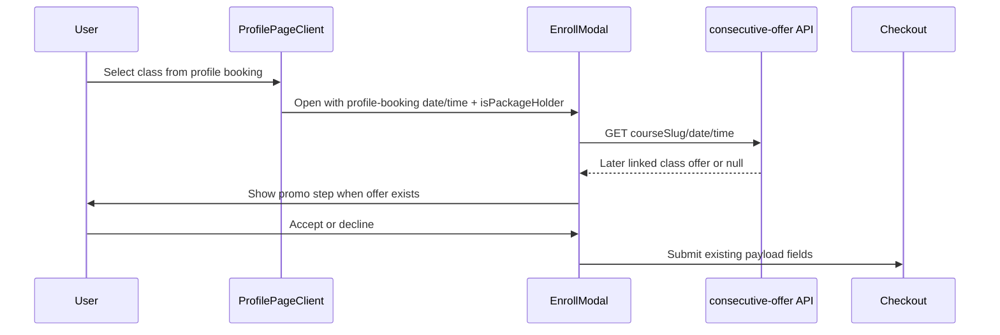

# Design: Profile Booking Consecutive Promo

## Flow

## Implementation Notes

- `ProfilePageClient` computes `profileHasUsablePackage` from `packagesData`.
- `EnrollModal` fetch gate becomes QR mobile OR check-in OR profile booking.
- Existing `effectiveIsPackageHolder` handles pricing once `isPackageHolder` is passed.

## Security / Validation

- No new auth path.
- Existing checkout validation remains authoritative for submitted primary and consecutive fields.
- Consecutive offer lookup remains non-mutating.

## Rollback

- Revert the `EnrollModal` fetch-gate change and `ProfilePageClient` prop wiring.
